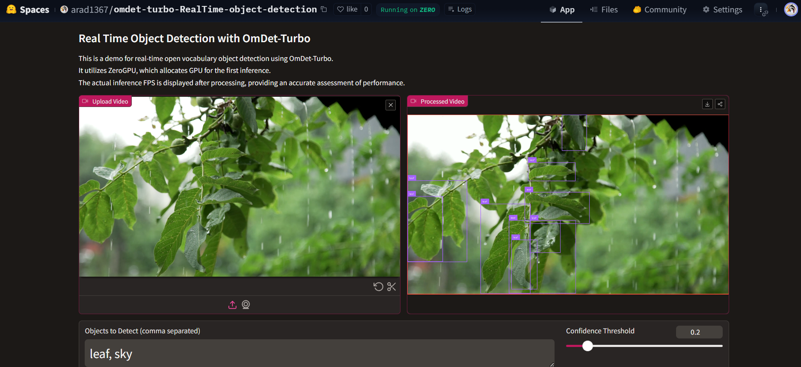

# Real-time Object Detection using OmDet-Turbo Model

* This repository contains a real-time object detection application that uses the OmDet-Turbo model, designed for open-vocabulary, zero-shot object detection. The model allows detecting objects in video frames with a flexible, customizable list of classes. This app is deployed using [Gradio](https://gradio.app) and is hosted on [Hugging Face Spaces](https://huggingface.co/spaces).

## Table of Contents
- [Overview](#overview)
- [Intended Use Cases](#intended-use-cases)
- [Model](#model)
- [Setup](#setup)
- [Deployment](#deployment)
  - [Deploy Locally](#deploy-locally)
  - [Deploy on Hugging Face Spaces](#deploy-on-hugging-face-spaces)
- [Code Usage](#code-usage)
  - [Single Image Inference Example](#single-image-inference-example)
  - [Batched Image Inference Example](#batched-image-inference-example)
- [Acknowledgements](#acknowledgements)
- [Contact](#contact)

## Overview
- This application leverages the OmDet-Turbo model to detect objects in real-time from video input. The model uses a zero-shot detection mechanism where the user can specify the list of objects (classes) they want to detect.



- This project is based on an open-source implementation by Yoni Gozlan. The original code can be found [here](https://huggingface.co/yonigozlan). The application supports both local deployment and cloud deployment using Hugging Face Spaces.

## Intended Use Cases
- Open-vocabulary object detection
- Real-time object detection in video streams
- Zero-shot object detection: detect objects without explicit training for a specific class

## Model
The app uses the **OmDet-Turbo** model, as described in the paper:
> **Real-time Transformer-based Open-Vocabulary Detection with Efficient Fusion Head** by Tiancheng Zhao, Peng Liu, Xuan He, Lu Zhang, Kyusong Lee.

The model can be accessed and further explored in the Hugging Face repository:
- [OmDet-Turbo Model on Hugging Face](https://huggingface.co/omlab/omdet-turbo-swin-tiny-hf)

## Setup
1. Clone the repository
```
   git clone https://github.com/yourusername/your-repo-name.git
   cd your-repo-name

```

2. Install the required dependencies: You can install all necessary dependencies using the provided requirements.txt file:
```
    pip install -r requirements.txt
```

3. Download or customize: You can simply download the app.py and requirements.txt files, customize them to your needs, and deploy directly on Hugging Face Spaces.

## Deployment
### Deploy Locally
- To run the app locally, you need to make a few changes:
- Remove Hugging Face-specific imports: Delete the `import spaces` line and the `@spaces.GPU decorator`.
- Run the app: After making the changes, run the app locally using:
```
    python app.py
```

## Deploy on Hugging Face Spaces
You can easily deploy the app on Hugging Face Spaces by following these steps:

- Create a new space on Hugging Face.
Upload the `app.py` and `requirements.txt` files to the space.
The space will automatically install dependencies and launch the app.
Hugging Face Spaces supports GPU acceleration, making it ideal for real-time object detection.

- For deployment, the easiest way is to:

Download the app.py and requirements.txt files.
Create a new Hugging Face Space.
Upload the files to the space, and your app will be up and running.

## Code Usage
Single Image Inference Example
Here is an example of how to use the OmDet-Turbo model for zero-shot object detection on a single image:
```
import requests
from PIL import Image
from transformers import AutoProcessor, OmDetTurboForObjectDetection

# Load the model and processor
processor = AutoProcessor.from_pretrained("omlab/omdet-turbo-tiny")
model = OmDetTurboForObjectDetection.from_pretrained("omlab/omdet-turbo-tiny")

# Example image and classes
url = "http://images.cocodataset.org/val2017/000000039769.jpg"
image = Image.open(requests.get(url, stream=True).raw)
classes = ["cat", "remote"]

# Preprocess and run the model
inputs = processor(image, text=classes, return_tensors="pt")
outputs = model(**inputs)

# Post-process results
results = processor.post_process_grounded_object_detection(
    outputs,
    classes=classes,
    target_sizes=[image.size[::-1]],
    score_threshold=0.3,
    nms_threshold=0.3,
)[0]

for score, class_name, box in zip(results["scores"], results["classes"], results["boxes"]):
    box = [round(i, 1) for i in box.tolist()]
    print(f"Detected {class_name} with confidence {round(score.item(), 2)} at location {box}")

```

## Batched Image Inference Example
You can also process a batch of images with different class detection tasks for each image:
```
import torch
import requests
from io import BytesIO
from PIL import Image
from transformers import AutoProcessor, OmDetTurboForObjectDetection

processor = AutoProcessor.from_pretrained("omlab/omdet-turbo-swin-tiny-hf")
model = OmDetTurboForObjectDetection.from_pretrained("omlab/omdet-turbo-swin-tiny-hf")

# Example images and tasks
url1 = "http://images.cocodataset.org/val2017/000000039769.jpg"
image1 = Image.open(BytesIO(requests.get(url1).content)).convert("RGB")
classes1 = ["cat", "remote"]

url2 = "http://images.cocodataset.org/train2017/000000257813.jpg"
image2 = Image.open(BytesIO(requests.get(url2).content)).convert("RGB")
classes2 = ["boat"]

url3 = "https://cdn.britannica.com/61/93061-050-99147DCE/Statue-of-Liberty-Island-New-York-Bay.jpg"
image3 = Image.open(BytesIO(requests.get(url3).content)).convert("RGB")
classes3 = ["statue", "trees"]

inputs = processor(
    images=[image1, image2, image3],
    text=[classes1, classes2, classes3],
    task=["Detect objects in image1", "Detect boats in image2", "Detect statue and trees in image3"],
    return_tensors="pt",
)

with torch.no_grad():
    outputs = model(**inputs)

# Post-process results
results = processor.post_process_grounded_object_detection(
    outputs, classes=[classes1, classes2, classes3], score_threshold=0.2, nms_threshold=0.3
)

for i, result in enumerate(results):
    for score, class_name, box in zip(result["scores"], result["classes"], result["boxes"]):
        box = [round(i, 1) for i in box.tolist()]
        print(f"Detected {class_name} with confidence {round(score.item(), 2)} at location {box} in image {i}")

```

## Acknowledgements
- The code in this repository is adapted from the work of `Yoni Gozlan`, whose implementation of OmDet-Turbo was used as the base for this application. Special thanks to Yoni for his excellent contributions.

## Contact
For any questions or inquiries, feel free to reach out:

* LinkedIn: [Pejman Ebrahimi](https://www.linkedin.com/in/pejman-ebrahimi-4a60151a7/)
* GitHub: [Pejman Ebrahimi](https://github.com/arad1367)
* Hugging Face: [OmDet-Turbo Real-time Detection](https://huggingface.co/spaces/arad1367/omdet-turbo-RealTime-object-detection)
* Email: `pejman.ebrahimi77@gmail.com` and `pejman.ebrahimi@uni.li`
